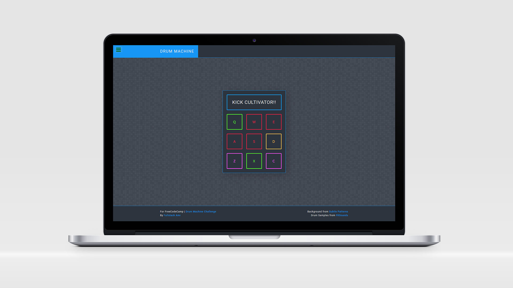

# DRUM MACHINE

This project was part of the [FreeCodeCamp](https://learn.freecodecamp.org/front-end-libraries/front-end-libraries-projects/build-a-drum-machine/) Front End Libraries Certification, which requires using a frontend framework to build a Drum Machine. the project must fulfill all the user stories and get all the tests passed.

---

Background from [Subtle Patterns](https://www.toptal.com/designers/subtlepatterns/random-grey-variations/) | Drum Samples from [99Sounds](ttp://99sounds.org/drum-samples/) | Bootstrapped by [create-react-app](https://github.com/facebook/create-react-app)